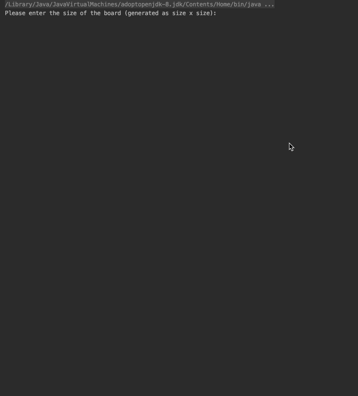

# Objective

- Write Game of Life with the most beautiful code you can write
- You can use any programming language that you’re most comfortable with
- Infinite grid is possible, array out of bound exception is possible
- The format of input and output is up to you

# Final Recording

# Build Instructions

This program is written in kotlin. 

You can install IntelliJ to better view the source code [here.](https://www.jetbrains.com/idea/download/#section=mac)

To download compiler, follow instructions [here.](https://kotlinlang.org/docs/tutorials/command-line.html)